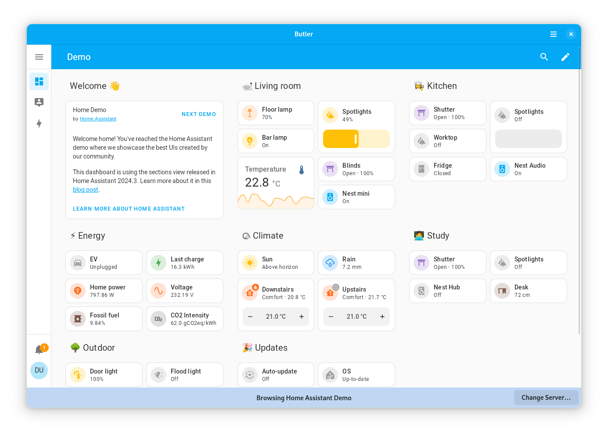

[][flathub]
[][flathub]

# Butler for Home Assistant

**Control your smart home**

Hybrid native + web app for Home Assistant. Butler wraps your Home Assistant dashboard up in a native UI, integrating better with your OS. Native features include:

- Icon in your App Grid, Applications Menu, Dash, Dock, etc.
- Native header bar
- Save and restore current view and size when closed and re-opened
- Two-finger swipe and mouse button support to go back/forward between views
- Cross-desktop light/dark style support for GNOME, elementary OS, etc.

Other features include:

- Pinch-to-zoom
- Set the scaling with Ctrl+Plus/Minus or Ctrl+0 to reset

## Made for GNOME

Butler is designed and developed on and for GNOME. As such, contributors agree to abide by the [GNOME Code of Conduct](https://wiki.gnome.org/Foundation/CodeOfConduct).

## Why not a web browser or PWA?

I don't love the state of web apps and PWAs on Linux; I prefer GNOME Web or Firefox, but the former doesn't truly support PWAs (just web apps with not-that-lightweight of a UI) and the latter doesn't support PWAs on the desktop at all. So, I made this dumb little web wrapper to give myself a bit more integrated of an experience.

If there's more interest in making this into a better-integrated companion app for Linux, I welcome contributions!

## Developing and Building

I recommend using GNOME Builder for development.

[flathub]: https://flathub.org/apps/details/com.cassidyjames.butler

